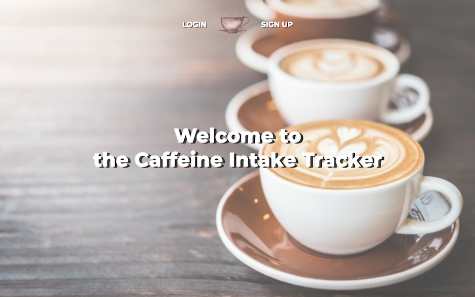
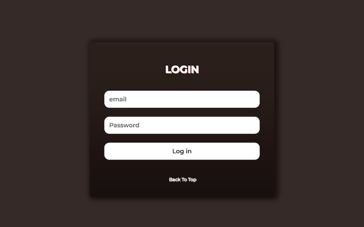
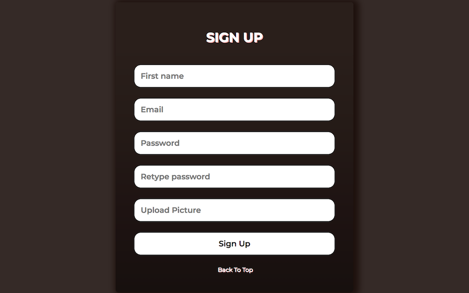
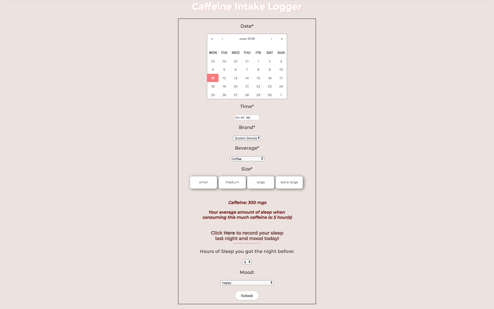
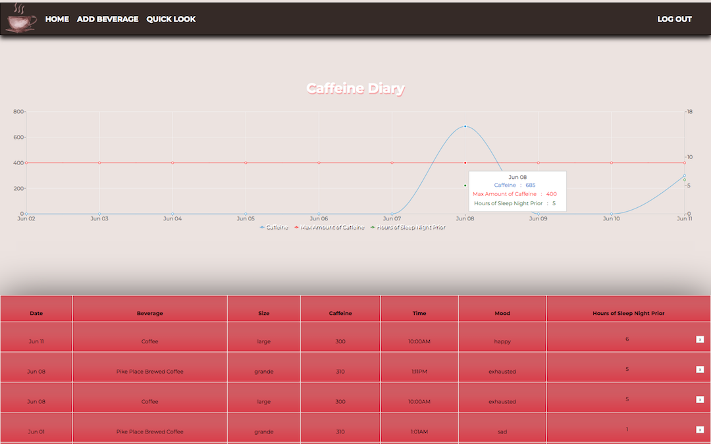
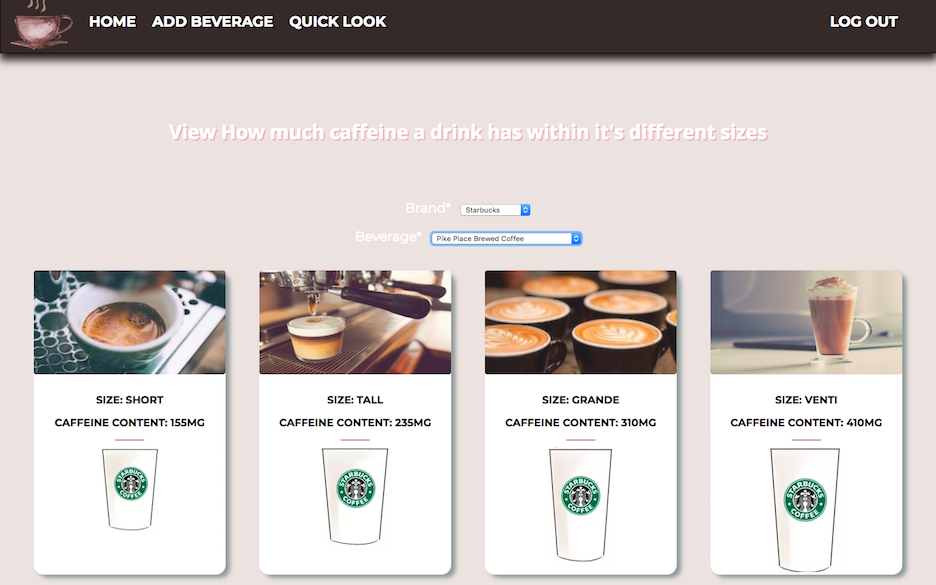
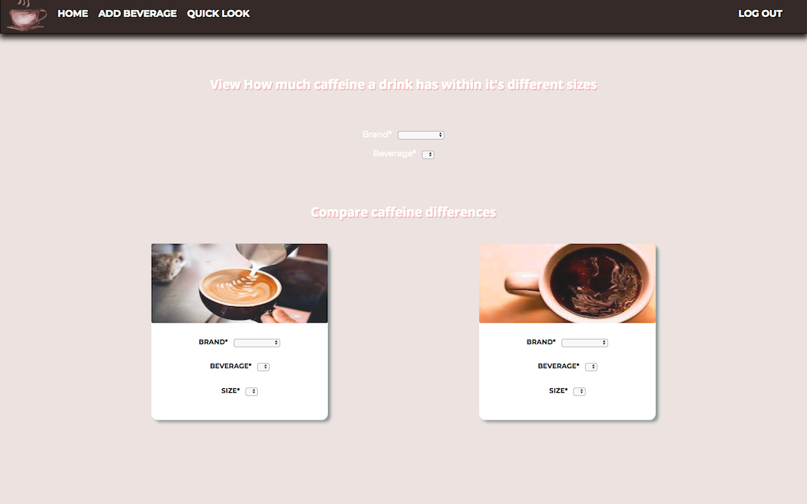

 # Caffeine Intake Tracker

Welcome to the Caffeine Intake Tracker. The wellness app that helps you become more aware of your caffeine intake along with your mood and sleep levels.

## Background

The problem this app resolves is that in which people usually intake a specific amount of caffeine on a regular basis. But some people, like myself, do not realize if the amount of caffeine they intake is more than how much one should normally be consuming.

*This is a problem because:*

- anything consumed in excess is harmful

- excess coffee, or highly caffeinated drinks could be correlated to health issues such as anxiety, stress, or insomnia. 

-	In addition, the problem is not being educated enough on how much caffeine different drinks contain
	- such as an iced latte vs. iced coffee
	- different brands such as Starbucks vs. Dunkin Donuts. 

## Features 

**Caffeine part of your everyday? Track your caffeine, sleep and mood levels.** 

* Sign up for an account or Login

  

* Log your caffeine beverage, hours of sleep the night before, as well as your mood for that day.
*Upon selection of beverage, and size, if one had previously inputted the same details, the app calculates the average amount of sleep one had the night prior upon consumption!* 

* Keep track of your intakes throughout the week on the data graph. 
* View past weeks intake on the graph summary below. 
 

 **Want just a general quick look about the caffeine in specific beverages?**

* Use the top quick look feature to view the caffeine levels of different sizes of a specific beverage

* Or use the bottom quick look feature to compare caffeine levels of two different beverages.*
 

**This same feature is available without needing an account, through the home page!**

## Technologies 

Express, Node.js and PostgreSQL were used to develop the back-end.
[ReactJS](https://reactjs.org/) and HTML/CSS were used to build the front-end. 

And the following packages were used as well:

* [Passport](http://www.passportjs.org/) - authentication for Node.js

* [Recharts](http://recharts.org/#/en-US/) - charting library 

* [Moment](https://www.npmjs.com/package/moment) - parse, validate, manipulate, and display formatted dates and times in JavaScript

## Future Features 

* Implement a mood tracker and data visiualization

* Push notifications for reminding to track intake

* Make it phone browser friendly

* Update the API with more caffeine data
